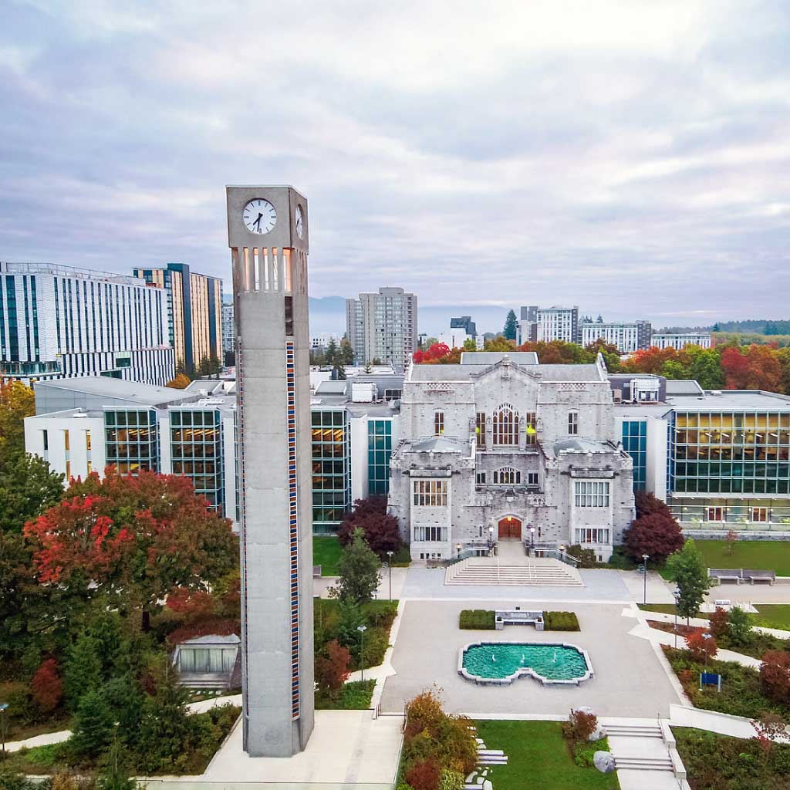

My first week at UBC was both exciting and worrisome. After a great long summer break at home, I was back in Vancouver to start the MDS program. The first few days were tiring because I was hit by jetlag badly and had to get myself familiar with new things at the new program.

This program is fast-paced as they called it, and I had a chance to experience that in my first week. Every weekday is busy with two lectures in the morning and one lab session in the afternoon. At the weekend, we have to prepare to submit all assignments. Also, my daily commute time is quite long, which makes everything even worse.

Tiring, stressful,... are the words to describe my situation. However, I believe things would get better once I am used to it. Importantly, I am not alone in this journey. I have cohort peers that will help and share the road with me and teaching team that always listen and understand.

